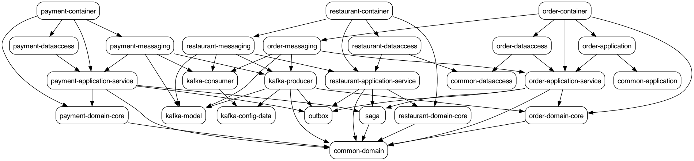

# Food-Ordering-System

Food-Ordering-System is a sophisticated food ordering system developed using the Java Spring Boot Framework. The system follows a
microservice-based architecture that adheres to Clean and Hexagonal architecture principles, making it scalable,
maintainable, and easily extendable. Some of the key technical features of Food-Ordering-System include:

* Implementation of the domain layer using Domain Driven Design (DDD) principles to ensure that the business logic is
  decoupled from the infrastructure layer.
* Use of SAGA, Outbox, and CQRS patterns to manage complex workflows in the system. SAGA pattern is used to handle
  distributed transactions, while Outbox pattern is used to ensure that the database writes are atomic and idempotent.
  CQRS pattern is used to separate the read and write models, providing a more scalable solution.
* Use of Apache Kafka as the event store, which enables the system to communicate between services and to implement the
  architectural patterns. Kafka allows for reliable messaging between the microservices, ensuring that each service
  operates independently of the others.
* Use of Spring Data JPA for PostgreSQL to communicate with the data stores in the microservices. The use of JPA allows
  for a simplified database access layer, while PostgreSQL provides a secure and scalable data storage solution.
* Use of Spring Kafka for Kafka, providing a streamlined and efficient method of communication between the services.
## Code structure
Each service is structured in the following manner -
```
order-service
├── order-application (Entrypoint)
|   └── com.food.ordering.system.order.service.application
|			  ├── exception.handler
|			  └── rest (REST Controllers)
├── order-container (Runnable Jar to package the service)
|   └── com.food.ordering.system.order.service.domain
| 			├── BeanConfiguration.java (Bean decl. for Domain-Service)
|			└── OrderServiceApplication.java
├── order-dataaccess (Data Layer)
|   └── com.food.ordering.system.order.service.dataaccess
|				└── table_name
|				    ├── adapter (Repository implentation)
|				    ├── entity (DB entity definitions)
|				    ├── mapper (DB entity <-> Domain entity)
|				    └── repository (Repository definition interface)
├── order-domain (Domain Layer)
│   ├──order-application-service (Adapters of input ports of target domain layer)
|   |  └── com.food.ordering.system.order.service.domain
|   |			├── config (Kafka topic names)
|   |			├── dto (REST Endpoint objects)
|   |			│   └── endpoint 
|   |			├── mapper (Request/Response <-> Domain entities)
|   |			├── outbox
|   |			│   ├── model (Kafka message payloads)
|   |			│   |   └── kafka_topic_name 
|   |			│   └── scheduler (Pulling schedulers, cleaners)
|   |			│       └── kafka_topic_name
|   |			├── saga (Saga Step Handlers/Adapters for ports)
|   |			└── ports (Interfaces)
|   |			    ├── input 
|   |			    │   ├── message.listener 
|   |			    │   │   └── input_kafka_topic_name
|   |			    │   └── service (REST Endpoint commandHandlers)
|   |			    └── output 
|   |			        ├── message.publisher
|   |			        │   └── output_kafka_topic_name
|   |			        └── repository (DB Operations)
│   └── order-domain-core (Core business logic)
│       └── com.food.ordering.system.order.service.domain
│            ├── entity (Object definitions)
│            ├── event (Domain Events)
│            ├── exception (Domain exceptions)
│            └── valueobject (Domain Valueobjects)
└── order-messaging (Messaging Layer)
       └── com.food.ordering.system.order.service.messaging
						├── listener.kafka 
						├── mapper (Avro models <-> Domain dtos)
						└── publisher.kafka
```

### SAGA


### Outbox


### Combined SAGA + Outbox


### CQRS


### Outbox Workflows
1. Happy Flow
   
2. Payment Failure
   
3. Approval Failue
   

## Domain Driven Design Diagrams

### Order Service


### Payment Service


### Restaurant Service


## Module Dependency Diagram




## Test scenario

"In the end-to-end test, when we create an order, it first goes to paid status, then after 10 seconds, a scheduled job runs and it changes to the approved status."


## Optimistic Locking scenario


## How to run?
### Requeriments

      java version 11
      
      Docker

      docker-compose up -d


## MY TODO LIST

- There is an issue with Debezium regarding the order transitioning from pending to approved. I will fix this. 
- Additions will be made to the README section.


